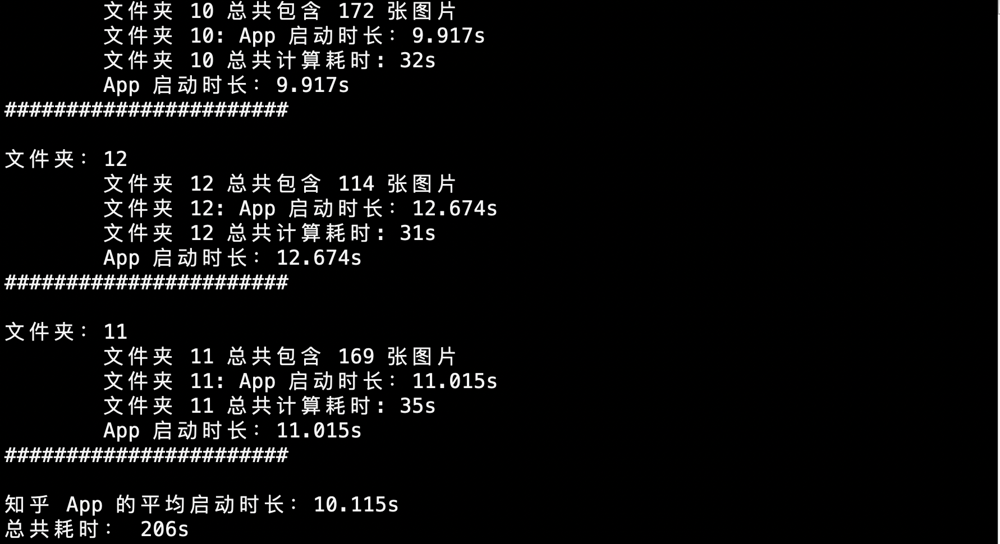

# Android App 启动时长测量工具
## 环境配置
+ python 3
+ pip3 install tensorflow

## 使用步骤
1. 手动安装需要测试的 App（本工具暂时支持「知乎」「头条」「百度」「微博」4种App）
2. 连接手机，只能连接一台手机，否则无法区分
3. 执行 sh ./android-run.sh
4. 按照提示选择需要测试的App（如下图所示）

    

## 程序执行结果

    

